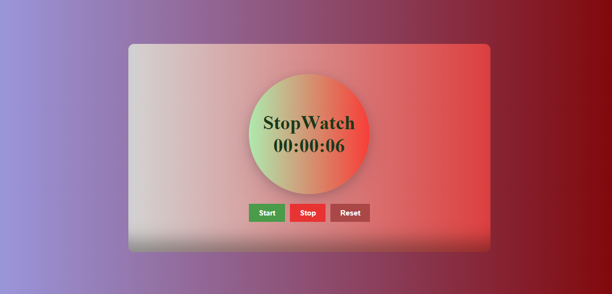

### By Akshun Verma

## Project Name: StopWatch

- In this project I have made StopWatch, which have features of Start, Stop and Reset. This is purely made up of Html, CSS, and JavaScript. It is responsive too. 

### ✍️ Author and 📞 Contact
- Akshun Verma
   - 
   - 

#### Honest time to finish the project !
 - I had taken around 2 hours to finish this project.

### Link of the website
- [Please Click Here](https://stopwatch3945.netlify.app/)

- 

 ### Feedback
 - If you have any feedback, please reach out to me at akshunverma45@gmail.com
